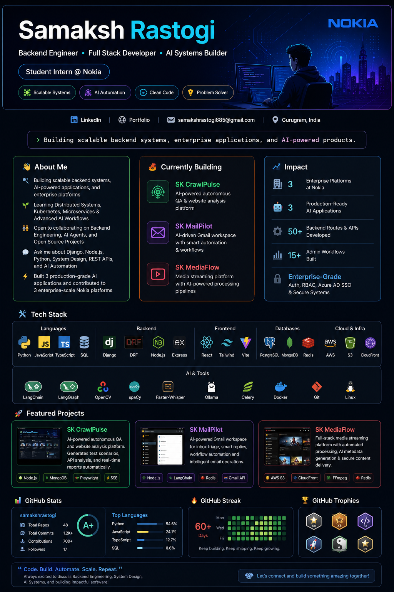

<p align="center">
  
</p>

<p align="center">
  
</p>

<p align="center">
  <a href="https://www.linkedin.com/in/samaksh-rastogi-9638b9254/">
    
  </a>
  <a href="https://sk-hub.in">
    
  </a>
  <a href="mailto:samakshrastogi885@gmail.com">
    
  </a>
</p>

<p align="center">
  
</p>

---

## 🚀 About Me

* 🔭 Building scalable backend systems, AI-powered applications, and enterprise-grade platforms
* 🌱 Learning Distributed Systems, Kubernetes, Microservices, and Advanced AI Agent Workflows
* 👯 Open to collaborating on Backend Engineering, AI Agents, and Open Source Projects
* 💬 Ask me about Python, Django, Node.js, System Design, REST APIs, and AI Automation
* ⚡ Built 3 production-grade AI applications and contributed to 3 enterprise-scale Nokia platforms

---

## 🔥 Currently Building

### 🚀 SK CrawlPulse

AI-powered autonomous QA platform for website analysis, API inspection, test generation, and real-time reporting.

### 📧 SK MailPilot

AI-powered Gmail workspace with inbox triage, smart replies, workflow automation, and intelligent email operations.

### 🎥 SK MediaFlow

Full-stack media streaming platform with AI-powered metadata generation, automated processing, and secure delivery.

---

## 🛠️ Tech Stack

### Languages

<p>

</p>

### Backend & APIs

<p>

</p>

### Frontend

<p>

</p>

### Database & Cloud

<p>

</p>

### Tools & DevOps

<p>

</p>

### AI & Automation

`LangChain` • `LangGraph` • `Ollama` • `OpenCV` • `spaCy` • `Faster-Whisper` • `Celery` • `BullMQ`

---

## 📈 Impact

| Achievement             | Impact                                        |
| ----------------------- | --------------------------------------------- |
| 🏢 Enterprise Platforms | Contributed to 3 Nokia platforms              |
| 🤖 AI Products          | Built 3 production-grade AI applications      |
| ⚙️ Backend Development  | 50+ routes & APIs implemented                 |
| 📊 Automation           | 15+ workflows and admin modules               |
| 🔐 Security             | Azure AD SSO, RBAC, enterprise authentication |
| 🎬 Media Processing     | Automated AI-powered video pipelines          |

---

## 🚀 Featured Projects

| Project           | Description                               | Stack                        |
| ----------------- | ----------------------------------------- | ---------------------------- |
| **SK CrawlPulse** | Autonomous QA & Website Analysis Platform | Node.js, MongoDB, Playwright |
| **SK MailPilot**  | AI-Powered Gmail Workspace                | Node.js, Redis, LangChain    |
| **SK MediaFlow**  | AI Media Streaming Platform               | AWS, FFmpeg, Redis           |

---

## 🏗️ Engineering Interests

```text
Backend Engineering
Distributed Systems
System Design
Cloud Architecture
AI Agents
Workflow Automation
Real-Time Applications
Scalable Software Design
```

---

## 📊 GitHub Analytics

<p align="center">
  
  
</p>

<p align="center">
  
</p>

---

## 🏆 GitHub Trophies

<p align="center">
  
</p>

---

## 🤝 Let's Connect

📍 Gurugram, India

📧 [samakshrastogi885@gmail.com](mailto:samakshrastogi885@gmail.com)

💼 LinkedIn: https://www.linkedin.com/in/samaksh-rastogi-9638b9254/

🌐 Portfolio: https://sk-hub.in

---

<p align="center">
  <b>Code. Build. Automate. Scale. Repeat. 🚀</b>
</p>

<p align="center">
Always excited to discuss Backend Engineering, System Design, AI Systems, and building impactful software.
</p>
